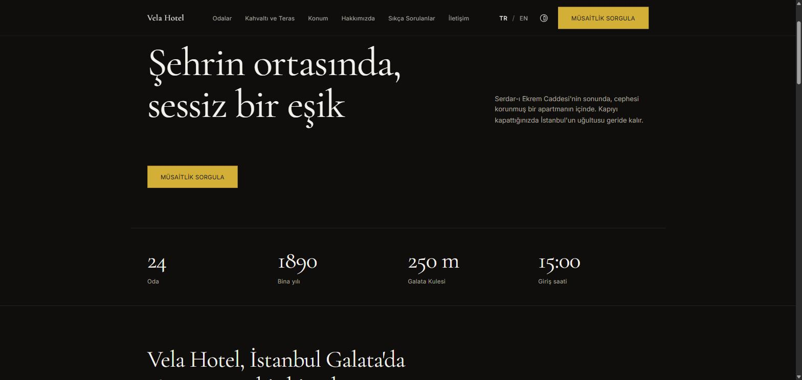

# Vela Hotel

İstanbul Galata'da kurgusal bir butik otel için tasarlanmış tanıtım sitesi.
Fotoğraf kullanmadan, yalnızca tipografi ve boşlukla kurulmuş bir tasarım denemesi.

**[Canlı demo → otel1website.vercel.app](https://otel1website.vercel.app)**

[](https://otel1website.vercel.app)

## Neler var

- **İki dil** — Türkçe ve İngilizce, ayrı adreslerle (`/tr/odalar` ↔ `/en/rooms`)
- **Açık ve koyu tema** — sistem tercihini izler, tek tıkla değiştirilebilir
- **Rezervasyon formu** — tarih, oda tipi ve kişi sayısı doğrulanır; JavaScript kapalıyken bile çalışır
- **Arama motorlarına hazır** — her sayfa build sırasında statik üretilir, canonical ve hreflang etiketleri otomatik
- **Erişilebilir** — WCAG AA kontrast oranları, klavyeyle tam gezinme, görünür odak halkası

## Tasarım notu

Otel sitelerinde en çok göze batan şey vasat stok fotoğraftır. Bu projede
fotoğraf hiç kullanılmadı; onun yerine iri serif başlıklar, ince çizgiler ve
sayılar (24 oda, 1890, 250 m) kompozisyonu taşıyor.

Otelin bütün bilgileri tek bir dosyada (`src/content/hotel.ts`) tutuluyor.
Ekranda görünen metin de arama motorlarına giden veri de aynı kaynaktan
besleniyor, böylece ikisi birbirinden ayrışamıyor.

## Kurulum

```bash
npm install
npm run dev
```

Tarayıcıda [localhost:3000](http://localhost:3000) adresini açın.

## Teknolojiler

Next.js 16 · TypeScript · Tailwind CSS v4 · next-intl

## Ölçümler

Canlı sitede, Lighthouse mobil:

| Accessibility | Best Practices | SEO | CLS |
|---|---|---|---|
| 100 | 100 | 100 | 0 |

Bu dördü her koşuda aynı çıkıyor. Performance skoru 86–100 arasında
değişiyor; ölçümün yapıldığı makinenin yüküne bağlı olduğu için tek bir
sayı vermek yerine aralığı yazıyorum. Kendiniz ölçmek isterseniz:
[pagespeed.web.dev](https://pagespeed.web.dev/analysis?url=https%3A%2F%2Fotel1website.vercel.app%2Ftr)

## Not

Vela Hotel gerçek bir işletme değildir. Adres, telefon, fiyatlar ve misafir
yorumları örnek veridir. Bu depo bir portfolyo çalışmasıdır.
